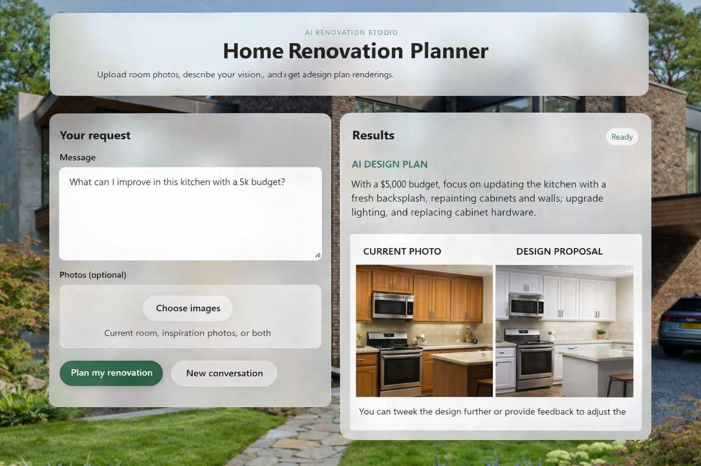
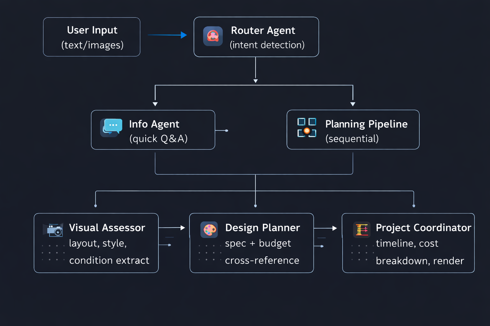

# 🏚️ AI Home Renovation Planner
### Full-Stack Multi-Agent AI System for Automated Renovation Planning & Visualization

[](https://home-renovation-planner.onrender.com/)
[](https://www.python.org/)
[](https://fastapi.tiangolo.com/)
[](https://ai.google.dev/)

**🔗 Live App:** https://home-renovation-planner.onrender.com/
**🔗 Repo:** https://github.com/arunimasharma33/home-renovation-planner

An end-to-end multi-agent AI system that analyzes photos of a room, produces a budget-aware renovation plan, and generates a photorealistic rendering of the finished space. Built on **Google ADK (Agent Development Kit)** with **Gemini Pro's** multimodal capabilities, orchestrating multiple specialized agents rather than a single LLM call — paired with a hand-built full-stack web app.

> 💡 **Try it live in under a minute:** upload a room photo on the [demo](https://home-renovation-planner.onrender.com/), give it a budget, and watch the agent pipeline plan and render a renovation.

---

## 📸 Demo



---

## 🏗️ Architecture

Rather than a single prompt-and-response wrapper, this project implements a **Coordinator/Dispatcher multi-agent pipeline**:


**1. Coordinator/Dispatcher Pattern** — a root Router agent analyzes intent and dispatches to either a lightweight Info Agent (general Q&A) or the full Planning Pipeline (design tasks).

**2. Sequential Planning Pipeline**
- **Visual Assessor** — ingests uploaded photos, extracts room layout and current condition, and parses styling cues from inspiration images.
- **Design Planner** — cross-references visual constraints with the user's stated budget to produce a specific, actionable design spec.
- **Project Coordinator** — compiles the spec into a timeline and cost breakdown, then calls generative tools to produce a photorealistic rendering.

**3. Full-Stack Execution**
- **FastAPI backend** handling multipart form uploads, async streaming, and session persistence across the conversation.
- **Vanilla JS/HTML/CSS frontend** (no framework) implementing a glassmorphism UI with drag-and-drop uploads and micro-animations — a deliberate choice to demonstrate CSS fundamentals rather than lean on a component library.

---

## ✨ Features

- **Smart image analysis** — detects room dimensions, layout, and style from current/inspiration photos.
- **Photorealistic rendering** — generates renders of the proposed space via generative vision models.
- **Budget-aware planning** — recommendations and scope are constrained to the user's stated budget.
- **Complete roadmap** — timeline, cost breakdown, and contractor checklist.
- **Iterative refinement** — session state persists so users can request changes conversationally (e.g. *"make the cabinets cream instead"*).

---

## 🧠 Why this project
Most AI portfolio projects are a single prompt wrapped in a chat UI. I wanted to build something closer to how AI features actually ship in production, a system where different parts of a task like understanding and reasoning are handled by specialized agents that give structured work to each other. Renovation planning was a good fit for this because it naturally breaks into distinct stages. First it assesses the space then plans the design and finally compile the output. 

It also gave me a reason to pair that orchestration work with a full, hand-built frontend, so the project demonstrates both the AI engineering side and the product/UI side rather than just one.

---

## 🚀 Try It Live

**No setup required** — the app is deployed: **https://home-renovation-planner.onrender.com/**

> Note: hosted on Render's free tier, so the first request after inactivity may take 20-30s to spin up.

## 💻 Run Locally

```bash
git clone <https://github.com/arunimasharma33/home-renovation-planner
pip install -r renovation_agent/requirements.txt
```

Create a `.env` file in the project root:
```env
GOOGLE_API_KEY=your_gemini_api_key_here
```
*(Get a free key at [Google AI Studio](https://aistudio.google.com/apikey))*

Run the server:
```bash
python ui/server.py
```

Open **http://127.0.0.1:3001** in your browser.

---

## 🛠️ Usage Scenarios

| Scenario | Example Input |
|---|---|
| **Current room + budget** | Upload kitchen photo + *"What can I improve with a $5k budget?"* |
| **Room + inspiration** | Upload your kitchen + a Pinterest photo + *"Transform my kitchen to look like this."* |
| **Text only** | *"Renovate my 10x12 kitchen with oak cabinets. Modern farmhouse style. Budget: $30k"* |
| **Iterative refinement** | After initial render: *"Make the cabinets cream and add pendant lights."* |

---

## 📁 Project Structure

```
.
├── renovation_agent/
│   ├── .adk/               # ADK agent config
│   ├── __init__.py
│   ├── agent.py            # Router, Visual Assessor, Design Planner, Project Coordinator agents
│   ├── tools.py            # Tool definitions used by the agents (e.g. image generation calls)
│   └── requirements.txt
├── ui/
│   ├── static/
│   │   ├── app.js          # Frontend logic (uploads, chat, rendering results)
│   │   ├── bg.png
│   │   ├── index.html
│   │   └── styles.css      # Glassmorphism UI
│   ├── __init__.py
│   └── server.py           # FastAPI app entrypoint
├── .gitignore
└── README.md
```
*(Adjust this to match your actual folder layout — reviewers use this to gauge whether the codebase is organized or a flat dump of files.)*

---

## 🧩 Tech Stack

- **Backend / Orchestration:** Python, FastAPI, Google ADK (Agent Development Kit)
- **AI Models:** Gemini Pro (multimodal vision & generation)
- **Frontend:** Vanilla JavaScript, HTML5, CSS3 (custom glassmorphism UI)
- **Architecture:** Coordinator/Dispatcher pattern, sequential agent pipeline, REST API

---

## 🗺️ Roadmap / Future Improvements

- [ ] Persist sessions to a database instead of in-memory state
- [ ] Support multiple room renders in a single project
- [ ] Cost estimation calibrated against real regional material pricing

---

## 👤 Author
Arunima
LinkedIn: https://www.linkedin.com/in/arunimasharma2005/
